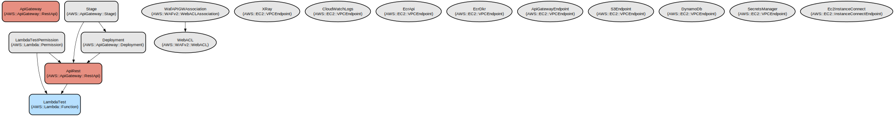

# AWS Infrastructure as Code Templates for Cloud-Native Applications

This repository provides a comprehensive collection of AWS CloudFormation templates and serverless configurations for deploying secure, scalable cloud-native applications. It enables rapid infrastructure provisioning with built-in security controls, monitoring, and best practices.

The repository contains infrastructure templates for essential AWS services including API Gateway, Lambda, VPC, WAF, ECS, CloudFront, and more. It implements a multi-environment (dev/qa/prod) approach with proper isolation and security controls. The templates support both serverless and container-based architectures with features like:

- Secure API endpoints with WAF protection and custom authorizers
- VPC configurations with private subnets and VPC endpoints
- Container orchestration with ECS and ECR
- Content delivery with CloudFront and S3
- Monitoring and observability with X-Ray and CloudWatch
- CI/CD pipelines with CodePipeline and CodeBuild

## Repository Structure
```
.
├── apigateway/           # API Gateway configurations and Lambda integrations
│   ├── api-rest.yaml    # Main API Gateway template
│   ├── code-lambdas/    # Lambda function source code
│   └── template.yaml    # API Gateway deployment template
├── cloudfront/          # CloudFront distribution and security headers
├── devops/             # CI/CD pipeline configurations
├── ecs/                # ECS cluster, service and task definitions
├── iam/                # IAM roles and policies
├── lambda/             # Lambda function configurations
├── s3-buckets/         # S3 bucket configurations
├── secrets-manager/    # Secrets rotation configurations
├── vpc/                # VPC and networking components
└── waf/                # WAF rules and security configurations
```

## Usage Instructions

### Prerequisites
- AWS CLI installed and configured
- AWS account with appropriate permissions
- Python 3.8+ (for Lambda functions)
- Node.js 16+ (for Lambda functions)
- Docker (for container builds)

### Installation

1. Clone the repository:
```bash
git clone <repository-url>
cd aws-infrastructure-templates
```

2. Configure AWS credentials:
```bash
aws configure
```

3. Install dependencies:
```bash
# For Python Lambda functions
pip install -r apigateway/code-lambdas/requirements.txt

# For Node.js Lambda functions
cd apigateway/code-lambdas
npm install
```

### Quick Start

1. Deploy a basic API Gateway with Lambda integration:
```bash
cd apigateway
aws cloudformation deploy \
  --template-file api-rest.yaml \
  --stack-name my-api \
  --parameter-overrides \
    Environment=dev \
    Project=myproject \
    ApiName=myapi
```

2. Deploy WAF protection:
```bash
cd waf
aws cloudformation deploy \
  --template-file waf.yml \
  --stack-name my-waf \
  --parameter-overrides \
    Environment=dev \
    Project=myproject
```

### More Detailed Examples

1. Deploy a complete VPC with private subnets:
```bash
cd vpc
aws cloudformation deploy \
  --template-file vpc.yml \
  --stack-name my-vpc \
  --parameter-overrides \
    Environment=dev \
    Project=myproject
```

2. Deploy an ECS service with load balancer:
```bash
cd ecs
aws cloudformation deploy \
  --template-file ecs-service-with-loadbalancer.yml \
  --stack-name my-ecs-service \
  --parameter-overrides \
    Environment=dev \
    Project=myproject \
    ServiceName=myservice
```

### Troubleshooting

Common Issues:
1. VPC Endpoint Creation Fails
   - Error: "VPC Endpoint creation failed"
   - Solution: Verify subnet and security group IDs are correct
   - Check VPC endpoint quotas in the region

2. WAF Rule Association Fails
   - Error: "WAF rule cannot be associated"
   - Solution: Ensure API Gateway stage exists
   - Verify WAF scope matches the resource type

3. Lambda Permission Issues
   - Error: "Lambda function permission denied"
   - Solution: Check IAM role permissions
   - Verify trust relationships

Debug Mode:
- Enable CloudWatch logs for API Gateway:
```yaml
MethodSettings:
  - DataTraceEnabled: true
    LoggingLevel: INFO
    MetricsEnabled: true
```

- Enable X-Ray tracing:
```yaml
TracingConfig:
  Mode: Active
```

## Data Flow
The infrastructure supports a typical web application architecture with the following data flow:

```ascii
Internet --> CloudFront --> WAF --> API Gateway --> Lambda/ECS --> RDS/DynamoDB
     ^                                    |
     |                                    v
     +---- S3 (Static Content) <----- CodePipeline
```

Key component interactions:
1. CloudFront distributes content and provides edge caching
2. WAF protects against common web vulnerabilities
3. API Gateway routes requests to appropriate backends
4. Lambda functions process API requests
5. ECS runs containerized applications
6. VPC endpoints provide secure service access
7. IAM roles control service permissions
8. CloudWatch provides monitoring and logging

## Infrastructure



### Lambda Functions
- `lambda-authorizer`: API Gateway custom authorizer
- `lambda-backend`: Main application backend
- `lambda-rotation`: Secrets rotation handler

### API Gateway Resources
- REST API with multiple endpoints
- Custom domain support
- WAF integration
- VPC Link support

### VPC Resources
- Private subnets for application tier
- VPC Endpoints for AWS services
- NAT Gateway for internet access

### Security Resources
- WAF rules for common attacks
- IAM roles with least privilege
- Security groups for network isolation

### Monitoring Resources
- CloudWatch Log Groups
- X-Ray tracing
- API Gateway access logs